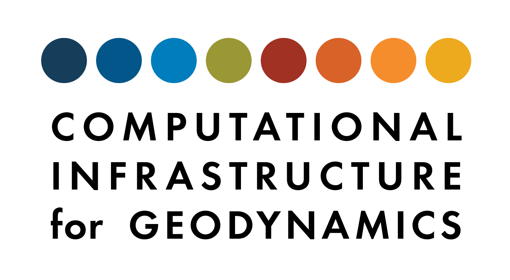

# Computational Infrastructure for Geodynamics (CIG) Best Practices

 

* [Software Development Best Practices](SoftwareDevelopmentBestPractices.md)

  *Minimum, Standard, and Target best practices related to development of scientific software.*

  The following resources support the Software Development Best Practices. Use them to improve your software project.

  * [Contributing Software Checklist](ContributingChecklist.md).
     
     Does your project fulfill these requirements? Consider [contributing](https://geodynamics.org/software/software-contribute) your software to the CIG community.  Questions? Need help? [Contact us](https://geodynamics.org/support/ticket/new).

  * [Software Repository Template](https://github.com/geodynamics/software_template). 
    Copy this repository to your own account to begin following best practices at the start of your project.

* [Training Best Practices](TrainingBestPractices.md)

  *Best practices for tutorials and hackathons for training users.*

* [Zenodo Best Practices](ZenodoBestPractices.md)

  *Best practices for obtaining a DOI from [Zenodo](https://zenodo.org/).*

 

 

*Visit us at [geodynamics.org](https://geodynamics.org/).*
